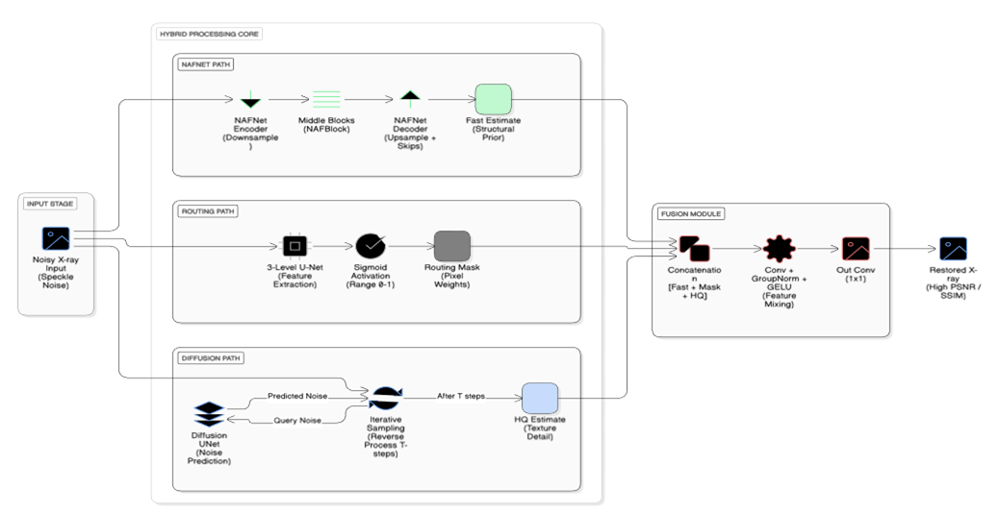
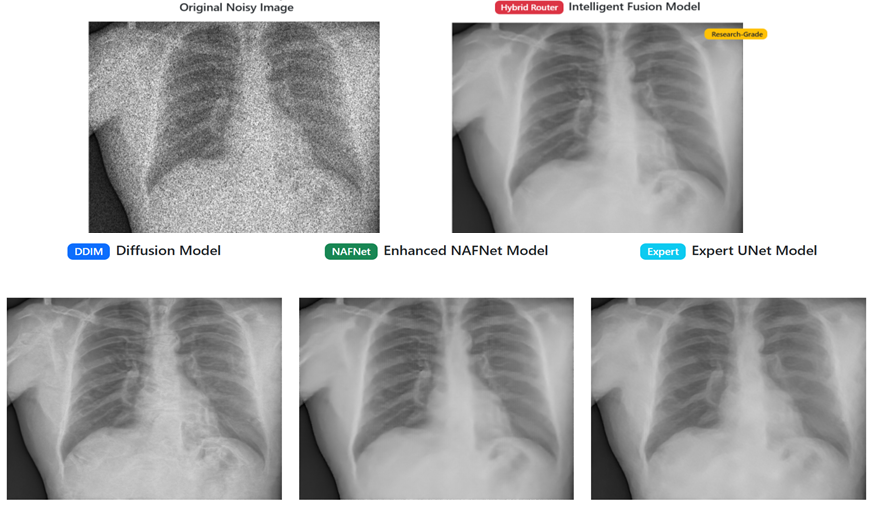

# Medi-Image Diffusion — Intelligent Hybrid X‑ray Denoising



An **adaptive X‑ray denoising framework** that **routes each pixel/region** through either:
- a **fast direct-mapping path** (Enhanced **NAFNet**) for smoother/easier regions, or
- a **high-fidelity diffusion path** (DDIM-based) for texture-rich / structurally complex regions,

then combines outputs via an **attention-based fusion module** to produce a clean, structurally faithful radiograph.



## Why this matters

Medical X‑ray images often suffer from **speckle**, **quantum**, and **Poisson** noise. These degradations can obscure subtle anatomical details (bone edges, rib structures, joint boundaries, soft‑tissue transitions). Classic filters may blur features, CNN denoisers can oversmooth, and diffusion models can be slow.  
This project targets a **balanced** solution: **high quality where needed** + **speed where possible**.

## Key results (as reported)

- **PSNR**: 35.80 dB  
- **SSIM**: 0.9282  
- **Inference time**: ~0.7s on NVIDIA Tesla P100  
- **Training data**: 500 paired X‑ray images  

## Tech stack

-  **Python**
-  **PyTorch** (+ `torchvision`)
-  **FastAPI**
-  **Uvicorn**
-  **React (CRA)**
-  **Node.js / npm**

## Repository layout

```text
.
├── Backend/                  # FastAPI server + PyTorch models
│   ├── run.py                # Backend entrypoint (uvicorn)
│   ├── requirements.txt      # Backend Python deps
│   └── models/               # Model weights (ignored by git)
└── frontend/                 # React UI
    ├── package.json
    └── src/
```

## Setup & run (local)

### 1) Backend (FastAPI)

From the repo root:

```bash
cd Backend
python -m venv .venv
.\.venv\Scripts\activate
pip install -r requirements.txt
python run.py
```

Backend will start at:
- **API**: `http://127.0.0.1:8000`
- **Docs**: `http://127.0.0.1:8000/docs`

#### Model weights (required)

`Backend/run.py` loads checkpoints from `Backend/models/` with these filenames:
- `ddimdiffusion.pth`
- `NafNet.pth`
- `DirectUNet.pth`
- `Latest_Hybrid_Denoiser.pth`

> **Note:** `Backend/models/` is intentionally **ignored** in `.gitignore` (model weights are typically too large for GitHub and may have redistribution constraints).  
> If you want to ship weights, use **Git LFS** or provide a download link.

### 2) Frontend (React)

In a new terminal:

```bash
cd frontend
npm install
npm start
```

Frontend will typically run at `http://localhost:3000`.

## API endpoints

- `GET /` — service status + available endpoints  
- `GET /health` — health check + model-loaded flags  
- `POST /denoise` — upload an image and receive base64 PNG outputs from:
  - diffusion
  - nafnet
  - expert
  - hybrid

## Pushing this project to GitHub

From the repo root (PowerShell or terminal):

```bash
git init
git add .
git commit -m "Initial commit: hybrid x-ray denoising (backend + frontend)"
git branch -M main
git remote add origin <YOUR_GITHUB_REPO_URL>
git push -u origin main
```

## Notes

- This repo contains large folders (e.g., `Backend/venv/`, datasets, weights). The root `.gitignore` is configured to keep these out of version control.
- If you need to share model checkpoints, prefer **Git LFS** or a **release artifact** / cloud link.

